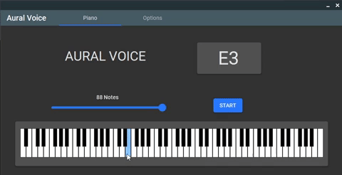

## Description
- Aural Voice is a pitch training program. Improve your hearing through relative pitch, or develop a simulated perfect pitch.
- Public version: Aural Voice 1.0.0, release date: Mar 13th, 2023.
- Made by Eivind H. Naasen, date of creation: Aug 21st, 2022.

## Technical Data
- Target OS: Windows 10
- GUI and Framework: Microsoft Windows Forms, .NET 6.0 - C#10
- IDE: Microsoft Visual Studio Community 2022, Version 17.3.1
- WinForms Theme: [MaterialSkin 2](https://github.com/leocb/MaterialSkin) by [leocb](https://github.com/leocb/).

## Features
- Support for all 88 piano keys.
- 5 different program settings: 
    - Acoustic Grand Piano
    - Electric Piano
    - Vibraphone
    - Drawbar Organ
    - Pan Flute
- Custom "note range" slider.
- Hotkey support: "qwertyu"
- Low latency input.
- Polyphony support.
- Freeplay mode.

## Preview

